# Post-contenido — Unidad 7: Patrones Arquitectónicos I

## Descripción
Repositorio del post-contenido de la Unidad 7 de Patrones de Diseño de Software. Un único proyecto Spring Boot (`multas-biblioteca-api`) para la gestión de multas de biblioteca, con dos partes: una API REST en capas (Model, Repository, Service, Controller) sobre H2, y el pago en línea de multas con dos pasarelas intercambiables por configuración (PagosUDES y Wompi), resuelto con un puerto de dominio y dos adaptadores.

## Estructura de paquetes
```
boada-post1-u7/
  README.md
  docs/capturas/                      evidencia de los endpoints
  simulador/PasarelasSimuladas.java   simulador local de las dos pasarelas
  multas-biblioteca-api/
    pom.xml
    src/main/java/com/example/multas/
      controller/       Presentación: MultaController, GenerarMultaRequest, GlobalExceptionHandler
      service/          Aplicación: MultaService
      model/            Dominio de la Parte 1: Multa, EstadoMulta y excepciones de negocio
      repository/       Persistencia: MultaRepository
      domain/           Parte 2 (sin Spring): puerto PasarelaPagoPort, ResultadoPago, PagoRechazadoException
      infrastructure/   Parte 2: pago/PagosUdesAdapter, pago/WompiAdapter, config/RestTemplateConfig
```
En la Parte 1 el flujo de dependencias es siempre hacia abajo: `controller` → `service` → `repository` → `model`, y el controlador nunca accede al repositorio. En la Parte 2 la dependencia entra hacia el dominio: `MultaService` conoce el puerto `PasarelaPagoPort` y los adaptadores de `infrastructure/` lo implementan.

## Parte 1 — Arquitectura en Capas
`MultaRepository` extiende `JpaRepository` y agrega una consulta agregada (`countByEstudianteIdAndEstado`). `MultaService` concentra las reglas de negocio que necesitan datos (límite de multas pendientes); el cálculo del monto vive en la propia entidad (`Multa.calcularMonto`). `MultaController` expone `/api/multas` y `GlobalExceptionHandler` traduce las excepciones de negocio a códigos HTTP.

### Endpoints
| Método | Ruta | Descripción | Respuestas |
|---|---|---|---|
| GET | `/api/multas` | Lista todas las multas | 200 |
| GET | `/api/multas/{id}` | Busca una multa | 200, 404 |
| GET | `/api/multas/estudiante/{estudianteId}` | Multas de un estudiante | 200 |
| POST | `/api/multas` | Genera una multa | 201, 400, 409 |
| PATCH | `/api/multas/{id}/pagar` | Pago en ventanilla | 200, 404, 409 |
| POST | `/api/multas/{id}/pagar-en-linea` | Pago en línea con la pasarela activa | 200, 402, 404, 409 |

### Reglas de negocio
- Monto = días de atraso × 500, con un tope máximo de 15000.
- Un estudiante no puede tener más de 3 multas pendientes.
- Una multa ya pagada no puede pagarse de nuevo (409), ni por ventanilla ni en línea.
- Un pago rechazado por la pasarela responde 402 y deja la multa pendiente.

## Parte 2 — Pago en Línea con Dos Pasarelas

### Decisión arquitectónica: opción C (puerto de dominio con dos adaptadores)
Frente al requisito de dos pasarelas intercambiables por configuración, se eligió la opción C, aplicada solo a esta porción del proyecto (la Parte 1 no se migró a hexagonal).

A favor de C:
- Cada pasarela tiene un contrato HTTP distinto (PagosUDES: `idTransaccion`/`estadoTransaccion`; Wompi: `reference`/`status` y montos en centavos). Con C esa diferencia queda encerrada en cada adaptador y no se filtra a `MultaService`.
- Agregar o quitar una pasarela es escribir o borrar un adaptador; el Service y el Controller no cambian. El requisito anticipa justamente ese cambio al terminar el piloto.
- El puerto y el tipo de resultado no dependen de Spring ni de ningún cliente HTTP, por lo que la regla de pago se entiende y se prueba sin infraestructura.

En contra de las opciones descartadas:
- A (`if/switch` en el Service): `MultaService` pasaría a conocer los formatos HTTP de ambas pasarelas, y una tercera obligaría a modificarlo.
- B (Strategy en `service/`): resuelve la intercambiabilidad, pero deja en la capa de servicio clases que hablan HTTP con terceros, mezclando integración externa con reglas de negocio.

### Cómo funciona el pago en línea
1. `POST /api/multas/{id}/pagar-en-linea` llega a `MultaController`, que delega en `MultaService.pagarConPasarela`.
2. El Service busca la multa (404) y verifica que no esté pagada (409) **antes** de llamar a la pasarela, para no cobrar dos veces.
3. Llama al puerto `PasarelaPagoPort.procesar(multa)`. El adaptador activo traduce la multa al formato de su pasarela, hace la llamada HTTP y devuelve un `ResultadoPago`.
4. Si el pago no fue exitoso se lanza `PagoRechazadoException` (402). Si lo fue, la multa se marca como pagada y `metodoPago` queda con el nombre del proveedor (`PAGOSUDES` o `WOMPI`).

### Configuración de la pasarela
En `application.properties`:
```
app.pagos.proveedor=pagosudes
app.pagos.pagosudes.url=http://localhost:9001/pagosudes/transacciones
app.pagos.wompi.url=http://localhost:9002/wompi/transactions
```
`@ConditionalOnProperty` crea solo el adaptador del proveedor elegido (`pagosudes` es el valor por defecto). Para usar Wompi basta cambiar el valor a `wompi` y reiniciar.

### Simulador de pasarelas
Las pasarelas reales no están disponibles, así que `simulador/PasarelasSimuladas.java` levanta dos servidores locales (PagosUDES en el puerto 9001 y Wompi en el 9002) que responden en el formato propio de cada una. Aprueban montos hasta 10000 y rechazan los mayores. Se ejecuta con `java simulador\PasarelasSimuladas.java`.

### Estado de las pruebas de la Parte 2
- **Verificado de extremo a extremo con PagosUDES** (adaptador por defecto, contra el simulador): pago exitoso (200), pago rechazado (402) y pago de una multa ya pagada (409). Ver capturas 10 a 12.
- **No verificado:** la ejecución con Wompi y el cambio de proveedor. `WompiAdapter` está implementado, compila y el simulador ya expone su endpoint, pero no se ejecutó la prueba de cambio de `app.pagos.proveedor` a `wompi` ni se tomaron capturas.

## Cómo ejecutar
```
cd multas-biblioteca-api
.\mvnw.cmd clean package
.\mvnw.cmd spring-boot:run
```
La API queda en http://localhost:8080 y la consola H2 en http://localhost:8080/h2-console (JDBC URL `jdbc:h2:mem:multas_biblioteca_db`, usuario `sa`, sin contraseña). Para probar el pago en línea, ejecutar antes el simulador en otra terminal, desde la raíz del repo:
```
java simulador\PasarelasSimuladas.java
```

## Herramientas utilizadas
- Java 17, Spring Boot 4.0.8, Spring Data JPA, H2, Bean Validation, RestTemplate
- Apache Maven, Postman, Git, GitHub

## Pruebas de los endpoints

### Parte 1
| # | Prueba | Resultado | Captura |
|---|---|---|---|
| 1 | Listar multas al inicio | 200, lista vacía | 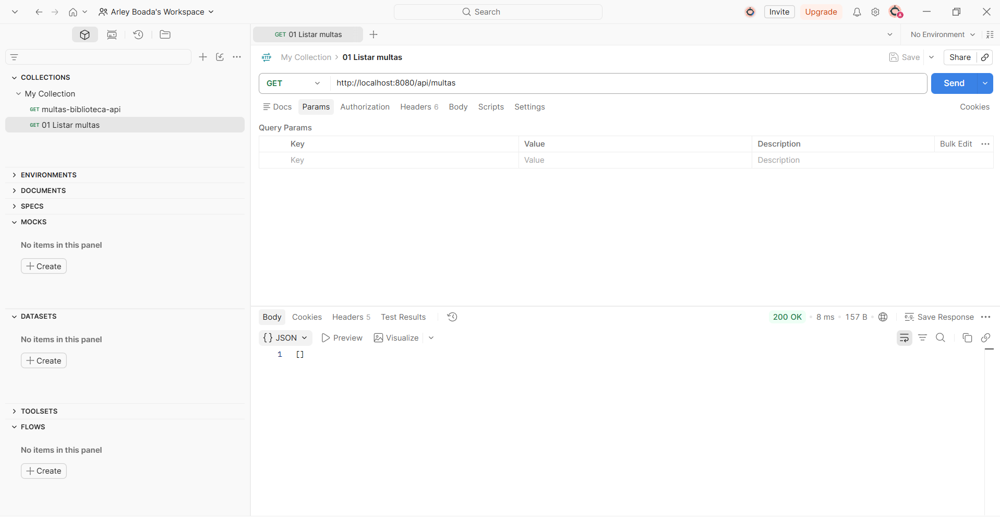 |
| 2 | Crear multa válida | 201, monto 2500 | 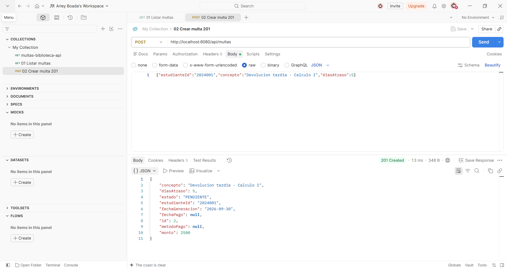 |
| 3 | Crear multa sin `estudianteId` | 400, mensaje de validación | 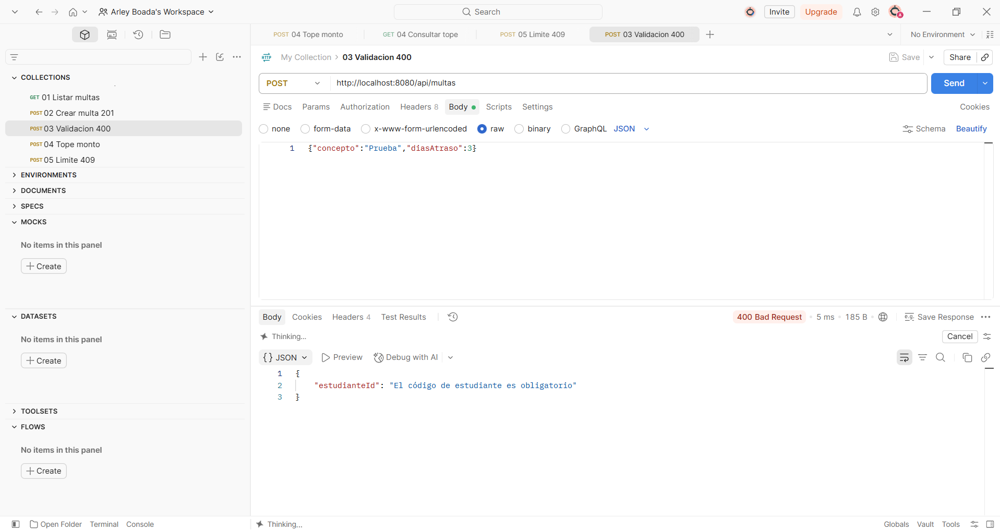 |
| 4 | Multa de 40 días (tope) | 200, monto 15000 | 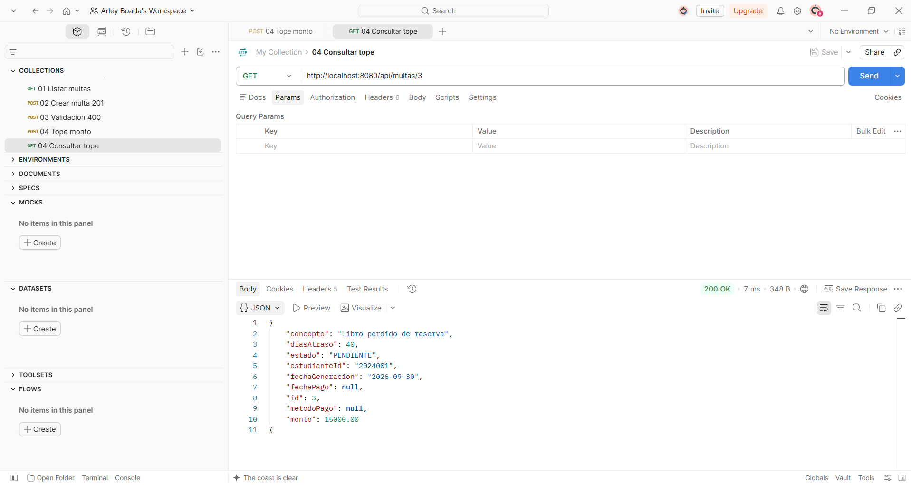 |
| 5 | Cuarta multa pendiente | 409, límite de 3 | 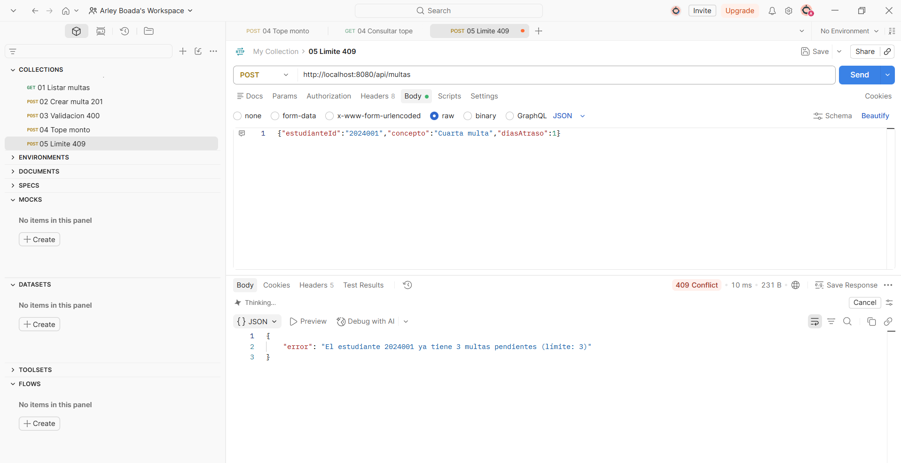 |
| 6 | Multa inexistente | 404 | 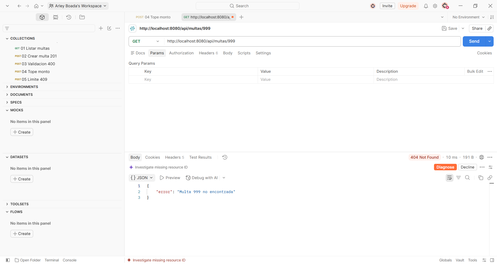 |
| 7 | Pago en ventanilla | 200, estado PAGADA | 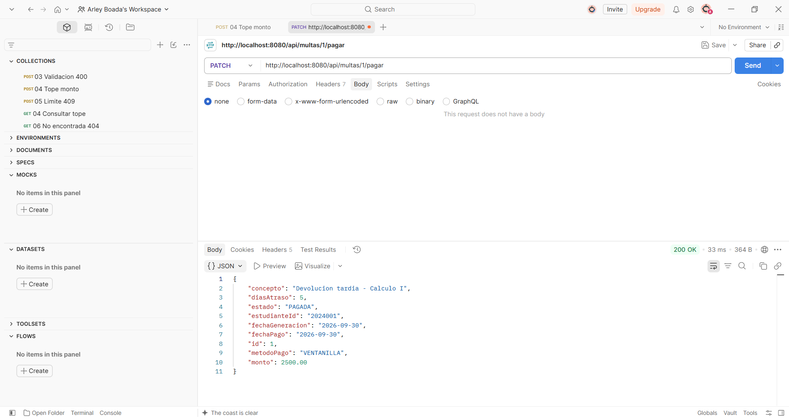 |
| 8 | Pagar una multa ya pagada | 409 | 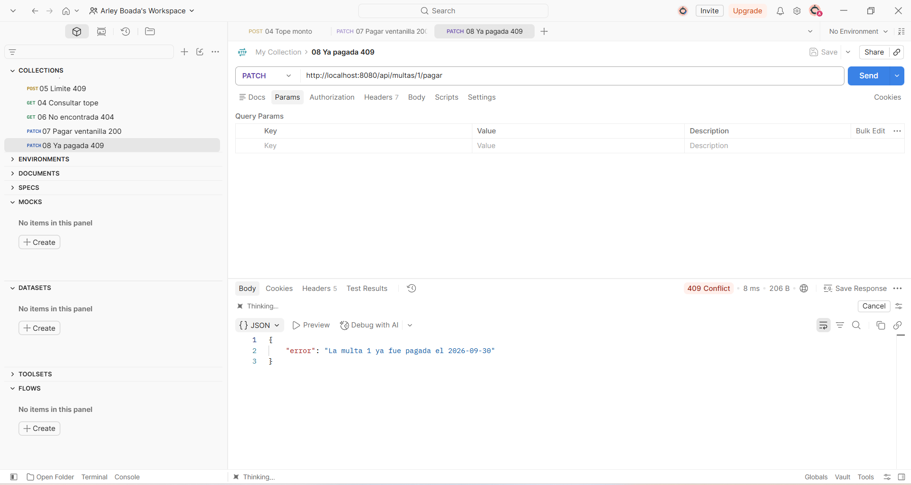 |
| 9 | Multas por estudiante | 200, 3 multas | 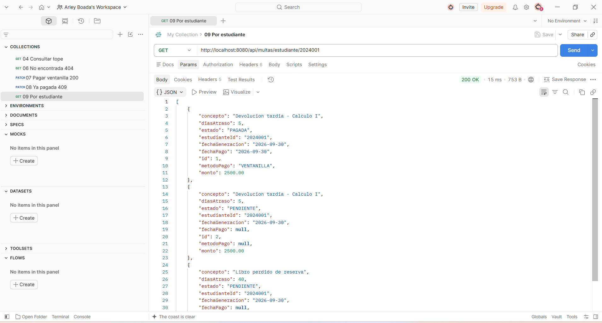 |

### Parte 2 (PagosUDES)
| # | Prueba | Resultado | Captura |
|---|---|---|---|
| 10 | Pago en línea de una multa de 2500 | 200, `metodoPago` PAGOSUDES | 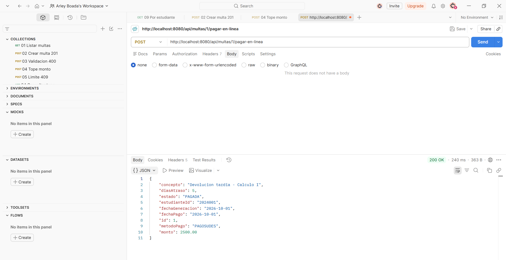 |
| 11 | Pago en línea de una multa de 15000 | 402, rechazado por la pasarela | 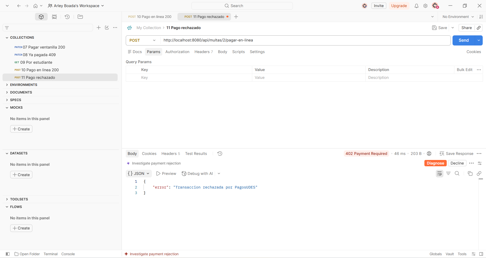 |
| 12 | Pago en línea de una multa ya pagada | 409, sin llamar a la pasarela | 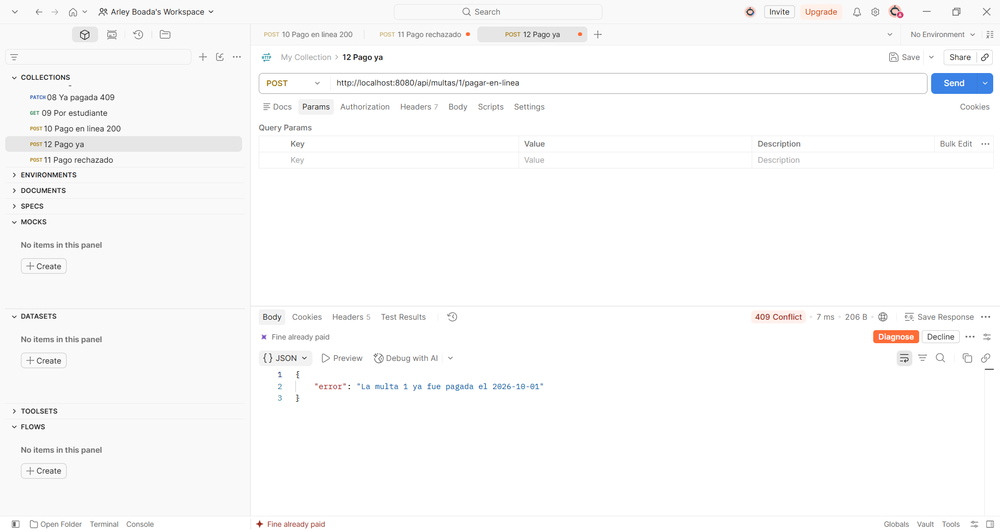 |

## Decisiones de diseño

### Punto de decisión 1 — Cálculo del monto: ¿entidad o Service?
**Decisión:** el cálculo del monto vive en la entidad. `Multa.calcularMonto(int diasAtraso)` es un método estático que aplica 500 por día con un tope de 15000.

**Por qué:** la regla solo depende del dato que recibe (los días de atraso). No necesita el repositorio ni ningún otro bean, así que su lugar natural es el objeto de dominio. Si una regla no necesita colaboradores externos, se queda en la entidad, que así tiene comportamiento y no es un simple contenedor de datos. Por la misma razón, `marcarComoPagada` también vive en `Multa`: protege su propio estado, y la entidad no expone setters para `estado`, `fechaPago` ni `metodoPago`.

**Alternativa descartada:** calcular el monto en `MultaService`. Funcionaría, pero la entidad quedaría anémica (solo getters y setters) y la regla quedaría atada a Spring: para probarla habría que construir el Service con sus dependencias.

### Punto de decisión 2 — Conteo de multas pendientes: ¿consulta o filtrado en memoria?
**Decisión:** el conteo de multas pendientes se resuelve con una consulta derivada del repositorio, `countByEstudianteIdAndEstado`, y el Service solo compara el resultado con el límite de 3.

**Por qué:** la decisión de negocio (¿se permite otra multa?) sigue en el Service, pero el dato que la respalda se obtiene donde es más barato: el motor de base de datos cuenta directamente (`SELECT COUNT(*)`) sin transferir las filas a la aplicación.

**Alternativa descartada:** usar `findByEstudianteId` y filtrar con un stream en el Service. Eso carga en memoria todas las multas del estudiante, incluidas las ya pagadas, solo para contarlas, y el costo crece con el historial de cada estudiante.

### Punto de decisión 3 — Selección del adaptador activo
**Decisión:** `@ConditionalOnProperty` sobre cada adaptador, de modo que según `app.pagos.proveedor` solo exista uno en el contexto de Spring (PagosUDES es el predeterminado con `matchIfMissing = true`).

**Por qué:** `MultaService` pide por constructor un único `PasarelaPagoPort`, sin `@Qualifier` ni lógica condicional propia. El requisito real es una pasarela fija por sede durante el piloto, y eso se resuelve al arrancar la aplicación.

**Alternativa descartada:** inyectar un `Map<String, PasarelaPagoPort>` y elegir el proveedor en tiempo de ejecución dentro del Service. Permitiría cambiar de pasarela sin reiniciar, pero obligaría a `MultaService` a conocer las claves de configuración de cada proveedor, y el requisito no pide esa flexibilidad. El costo de lo elegido es que cambiar de pasarela exige reiniciar la aplicación.

### Punto de decisión 4 — Diseño del puerto y el tipo de resultado
**Decisión:** ambos adaptadores devuelven el mismo `ResultadoPago(proveedor, exitoso, referenciaExterna, mensaje)`. Los formatos propios de cada pasarela quedan como `record` privados dentro de su adaptador.

**Por qué:** `MultaService` solo conoce el contrato común: consulta `exitoso()` y registra `proveedor()`. Agregar una tercera pasarela es escribir un adaptador, sin tocar el Service.

**Qué se rompería con la alternativa:** si el puerto devolviera el DTO propio de PagosUDES o de Wompi (o tuviera un método por proveedor), el Service tendría que conocer y distinguir ambos formatos, y cada pasarela nueva lo obligaría a modificarse. Y si `ResultadoPago` tuviera un campo `idTransaccion` en vez de `referenciaExterna`, `WompiAdapter` tendría que inventar un valor o usar un nombre que no describe lo que Wompi realmente devuelve (`reference`): una señal de que el tipo de dominio no era neutral respecto a los proveedores.

### Trade-off considerado — Parte 2
Se eligió la opción C (puerto de dominio con dos adaptadores) y se descartaron la A (`if/switch` en el Service) y la B (Strategy dentro de `service/`). Se ganó que `MultaService` no conoce ningún formato HTTP, que las pasarelas se intercambian por configuración y que sumar o quitar una no toca el Service. Costó más estructura: dos paquetes nuevos (`domain/` e `infrastructure/`), seis archivos (puerto, resultado, excepción, dos adaptadores y la configuración de `RestTemplate`) y la curva de aprendizaje del patrón, todo para solo dos proveedores. Si el piloto terminara y quedara una sola pasarela, la opción B habría sido suficiente y se consideraría simplificar: el puerto seguiría siendo útil, pero separar `domain/` de `infrastructure/` sería más estructura de la necesaria. Un matiz adicional: el puerto importa `Multa`, que lleva anotaciones de JPA, así que el dominio no es del todo puro; fue una concesión consciente para no duplicar la entidad en un proyecto de este tamaño.

## Conclusiones
Separar dónde vive cada regla fue lo más útil del laboratorio: el cálculo del monto en la entidad porque no necesita colaboradores, el límite de multas pendientes en el Service porque necesita datos, y las diferencias entre pasarelas en los adaptadores porque son detalles externos. Lo que hizo más difícil decidir entre extender las capas o introducir el puerto fue que, con solo dos pasarelas, la opción B también resuelve el problema. Pesaron más dos hechos del requisito: los contratos HTTP son distintos y se anticipa agregar o quitar proveedores. También quedó claro que una decisión arquitectónica hay que verificarla de extremo a extremo: aquí se comprobó con PagosUDES, y el cambio a Wompi queda como prueba pendiente.